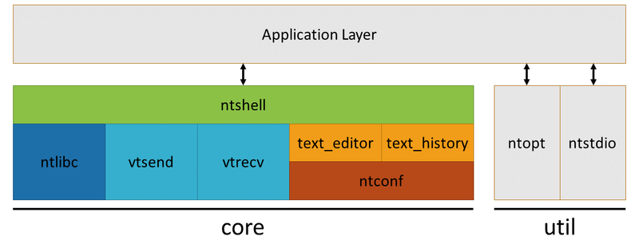
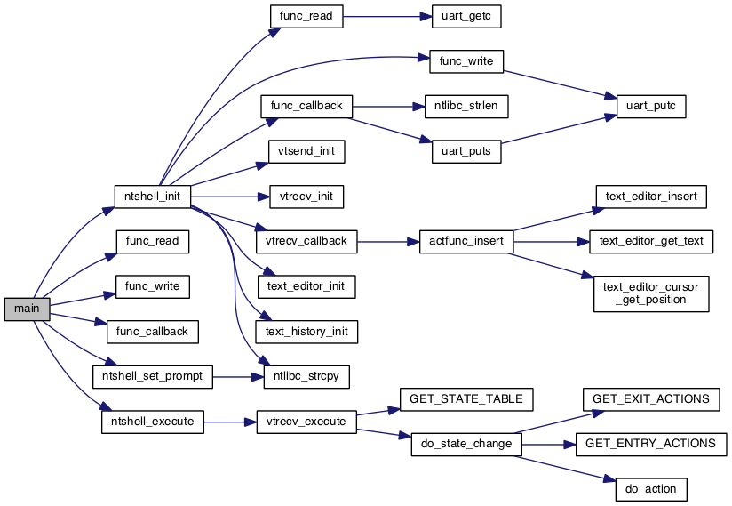

# Natural Tiny Shell (NT-Shell)

Natural Tiny Shell (NT-Shell) is a C library for embedded systems.
- https://cubeatsystems.com/ntshell/index.html

## Architecture

## Features

- Compatible with VT100 :)
- Really simple.
  - The API has only three functions.
  - It consists of only three small modules.
- Highly portable.
  - Compatible with C89.
  - No dependencies. (even libc!)
  - No dynamic memory allocation. (no need a operating system!)
- Small code foot print.
  - ROM: 10KB
  - RAM: 1KB

## Core Components

### Top Interface Module
NT_SHELL的顶层调用，包含资源初始化，cmd命令注册等
- `ntshell.c`, `ntshell.h`

### VT100 Sequence Controller
TAB补全、删除等按键命令识别解析的实现
- `vtsend.c`, `vtsend.h`
- `vtrecv.c`, `vtrecv.h`

### Text Controller
文字输入的光标控制，历史命令记录等的实现
- `text_editor.c`, `text_editor.h`
- `text_history.c`, `text_history.h`

### C Runtime Library
自主实现的C库源码
- `ntlibc.c`, `ntlibc.h`

### Utility
命令解析，stdio库函数如sprintf等的实现
- `ntopt.c`, `ntopt.h`
- `ntstdio.c`, `ntstdio.h`

## The call graph

## Keyboard Shortcuts

| Action                          | Key Input                |
|---------------------------------|--------------------------|
| Move to the start of line       | `CTRL+A` or `Home`      |
| Move to the end of line         | `CTRL+E` or `End`       |
| Move forward one character      | `CTRL+F` or `Right arrow` |
| Move back one character         | `CTRL+B` or `Left arrow`  |
| Delete previous character       | `Backspace`             |
| Delete current character        | `CTRL+D` or `Delete`    |
| Cancel current input line       | `CTRL+C`                |
| History search (backward)       | `CTRL+P`                |
| History search (forward)        | `CTRL+N`                |
| Input suggestion from history   | `TAB`                   |

## Actual Size

| Section       | Size(byte)    |
|---------------|---------------|
| Code          | `5688`        |
| RO-data       | `2412`        |
| RW-data       | `0`           |
| ZI-data       | `1776`        |
| **Total**     | `9876`        |

Notes：
- The size is based on the `ARM CLANG(V6.22)` compiler and the optimization level is `-O1`.
- The cmd list size is 16, and the remaining space is reserved for parameters.

## Notice

- The NT_SHELL option must be turned on at compile time.
- Maximum length for the editor module is 64, modify NTCONF_EDITOR_MAXLEN in <ntconf.h>
- The max command length is 16, and the remaining space is reserved for parameters. modify NT_SHELL_CMDLIST_NUMBER in <nttop.h>
- Only support one cmd, others are parameters. such ad: [cmd] [param0] [param1] [...]
- If a serial assistant such as SSCOM is used, the return feed option(回车换行) must be enabled